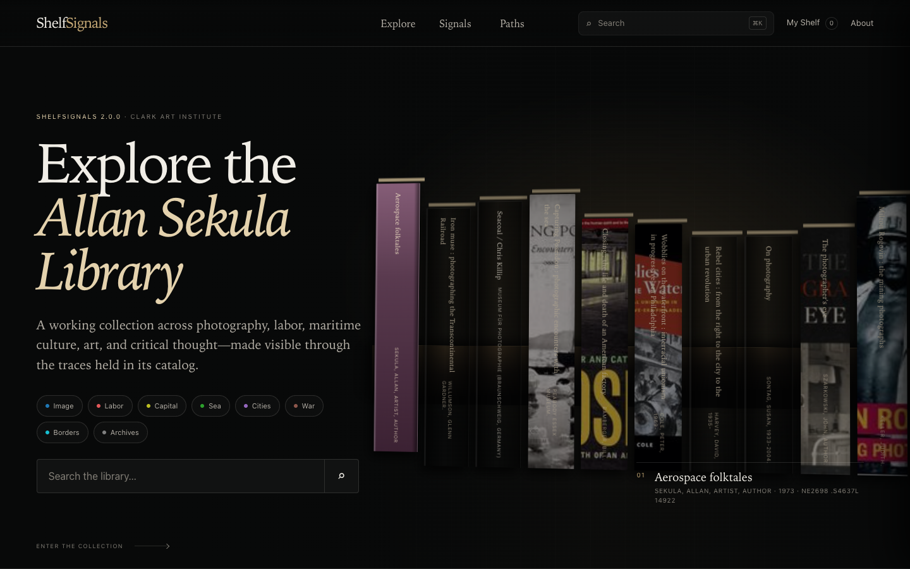

# ShelfSignals 2.0.0: introduction and user guide

ShelfSignals is an editorial collection browser for the Allan Sekula Library at the Clark Art Institute. It starts from catalog evidence—titles, creators, subjects, dates, identifiers, formats, call numbers, notes, provenance, and Clark record links—and turns that evidence into an explorable field of relationships.



## What the interface represents

The primary interface combines two kinds of book image:

1. A small set of remote cover references resolved offline through conservative identifier matches and recorded in `docs/data/book_visuals.json`.
2. CSS-generated book objects for all other records. These use real record metadata and deterministic colors; they do not claim to reproduce a physical cover or spine.

All displayed titles, creators, dates, call numbers, subjects, notes, and Clark catalog destinations come from `docs/data/sekula_index.json`.

## Start browsing

Open the [primary ShelfSignals interface](https://gitbrainlab.github.io/ShelfSignals/). No account, API key, backend, or build step is required.

### Featured shelf

The opening shelf is a bounded editorial selection of real Alma record IDs from `docs/data/featured_items.json`. Hover, focus, or tap a book to identify it; click or press Enter to open the record drawer. Mobile users can pan the shelf horizontally.

### Search

Use the large opening search field, the collection search field, or Command/Ctrl+K. Search covers:

- title and alternate title;
- creators and contributors;
- subjects;
- request call number;
- notes and Sekula provenance;
- publisher, format, description, and contents;
- ISBN, ISSN, OCLC, LCCN, Alma MMS, and record ID.

Multiple words are combined: every term must occur somewhere in the record's indexed metadata.

### Signals and paths

Signals are reproducible keyword rules registered in `docs/js/signals.js`. They reveal possible thematic relationships such as Image, Labor, Capital, Sea, Cities, Borders, Archives, Art, and Theory.

Curated paths are editorial descriptions plus signal rules. The current configuration does not contain fixed item lists, so the result count is calculated from the dataset each time and is labeled as a dynamic match. A path is an invitation to investigate, not a statement that every result was individually selected by a curator.

### Collection filters

The primary browser provides:

- signal filtering;
- parsed call-number-class filtering;
- material-type filtering;
- decade filtering;
- experimental photo-likelihood buckets;
- grouping by call-number class, decade, or material;
- cover, spine, and accessible list modes.

Only 72 more results are added to the DOM per batch, even when all 11,176 records match.

### Record details

The drawer contains the canonical catalog title and the fields available for that record. “View in Clark catalog” uses the record's exact `record_url`. Previous/next follows the active filtered result set.

The collection's `call_number` is usually the Sekula physical request/accession mark, not a topical LC classification. ShelfSignals keeps that distinction visible and does not infer room-wall positions from ordinary LC cutters.

The Embedded Photography Likelihood field is labeled as an experimental metadata estimate. The currently committed values were produced by the repository's mock heuristic pipeline; they are not statements based on inspecting the physical copy.

## My Shelf

“My Shelf” is stored locally in the browser as a list of Alma record IDs. No account is created and no shelf data is sent to a ShelfSignals server.

You can:

- add or remove records;
- keep the shelf across reloads;
- export a text reading list containing real Clark catalog URLs;
- export a hash-verified Digital Receipt JSON file;
- restore a supported receipt and resolve its item IDs against the current dataset.

QR export is not offered in `2.0.0`: the earlier prototype displayed a placeholder rather than encoding a genuine QR code.

## Shareable URLs

The selected record and meaningful collection state can be shared through query parameters. Examples:

```text
?record=alma991002035079708431
?q=waterfront+labor&view=list
?signals=image,labor&group=decade
?path=labor-images
```

Stable Alma IDs are used instead of array positions.

## Accessibility and motion

- Use Tab to reach navigation, signals, featured records, filters, and result cards.
- Press Enter/Space to activate native buttons.
- Press Escape to close a drawer or dialog.
- Use Left/Right Arrow while a record drawer is open.
- Use Command/Ctrl+K to open global search.
- Select List mode for dense research reading.
- `prefers-reduced-motion` removes nonessential transitions and smooth scrolling.

The interface uses visible focus states, semantic landmarks, text controls for all spatial books, and dark colors tested for readable contrast.

## Interface routes

- `/` — primary `2.0.0` interface.
- `/legacy/` — archived v1 interface.
- `/preview/` — preserved Preview research interface.
- `/preview/exhibit/` — preserved Exhibit interface.

See [the interface guide](docs/interfaces.md) for architectural and migration details.

## Run locally

From the repository root:

```bash
python3 -m http.server 8000 --directory docs
```

Then open `http://localhost:8000/`. Do not use `file://`; modules and catalog data are fetched over HTTP.

Run the fast contract tests:

```bash
node scripts/cinematic_unit_tests.mjs
node scripts/preview_acceptance_tests.mjs
```

Run browser smoke tests after installing Playwright and Chromium:

```bash
python3 -m pip install playwright
python3 -m playwright install chromium
python3 scripts/cinematic_smoke_tests.py
```

## Cover enrichment

A small dry run does not write output:

```bash
python3 scripts/enrich_book_visuals.py --limit 5 --dry-run
```

A cached refresh writes the versioned manifest without downloading cover binaries into the repository:

```bash
python3 scripts/enrich_book_visuals.py --limit 100
```

Matches prefer exact ISBN and record their provider, identifier, confidence, attribution, timestamps, and source link. Negative, ambiguous, and error outcomes are cached so repeated runs remain respectful of public providers. See [cover enrichment and attribution](docs/cover-enrichment.md).

## Privacy and security

- Catalog metadata is rendered through text nodes, not interpolated as executable HTML.
- External cover URLs must use HTTPS and an allowlisted provider host.
- Clark links open with `noopener noreferrer`.
- The browser contains no API keys.
- Shelf state and receipts remain client-side unless the user chooses to share a file.

## Known limitations

- Initial download still includes the full canonical catalog dataset. Normal HTTP compression reduces transfer size, but parsing cost depends on the device.
- Remote covers can disappear or rate-limit. Every record remains usable through its metadata-derived representation.
- Keyword signals can produce false positives or miss context; they are discovery aids.
- The dataset does not expose a trustworthy “recently added” date, so the primary UI uses editorial highlights rather than making that claim.
- Most physical accession marks begin `NE`; richer topical LC browsing requires exporting Primo's separate bibliographic call number in a future harvest.

## About the Allan Sekula Library

The project documentation describes the library as a collection spanning photography, labor history, maritime culture, political economy, art, cities, archives, and critical theory. ShelfSignals does not attempt to summarize Sekula's library into one theme. It offers several catalog-grounded ways to move through it while keeping the Clark catalog one click away.
