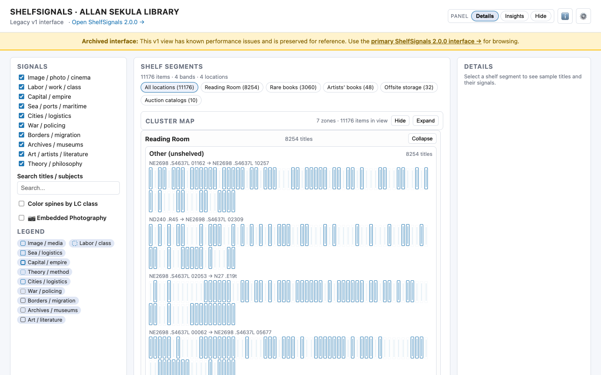
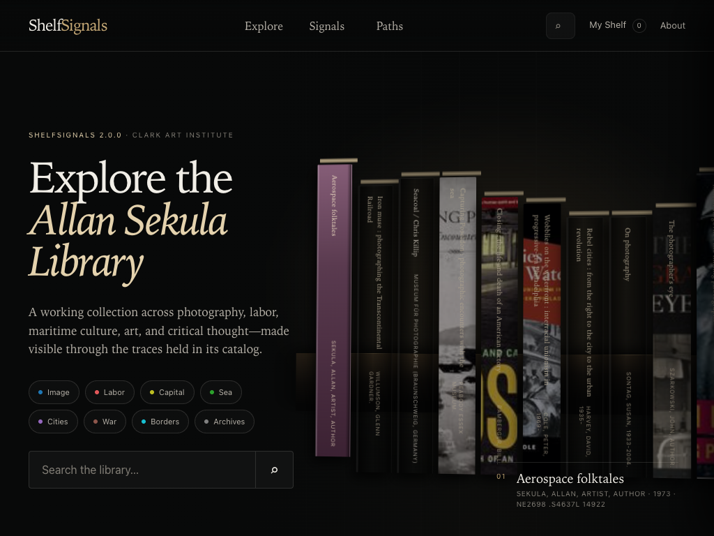

# ShelfSignals 2.0.0 visual QA

These images are produced by `scripts/browser_smoke_test.py --screenshot-dir docs/images` against a local static server after the browser assertions pass.

## Before: archived v1 at 1440 × 900

## After: primary 2.0.0 at 1440 × 900

## Tablet: 1024 × 768

## Mobile: 390 × 844

## Verification checklist

- Featured titles, authors, dates, and call numbers are resolved from `sekula_index.json`.
- Verified cover references and metadata-derived book objects remain visually distinct.
- Navigation and search remain readable over the dark editorial surface.
- No document-level horizontal overflow occurs at 390 px.
- The mobile collection browser renders two columns and the featured shelf remains horizontally browsable.
- The application renders 72 results initially rather than all 11,176 DOM elements.
- Detail, search, signal filtering, exact Clark URL, My Shelf reload, reduced motion, Legacy, and Exhibit routes pass the automated browser suite without console errors.
